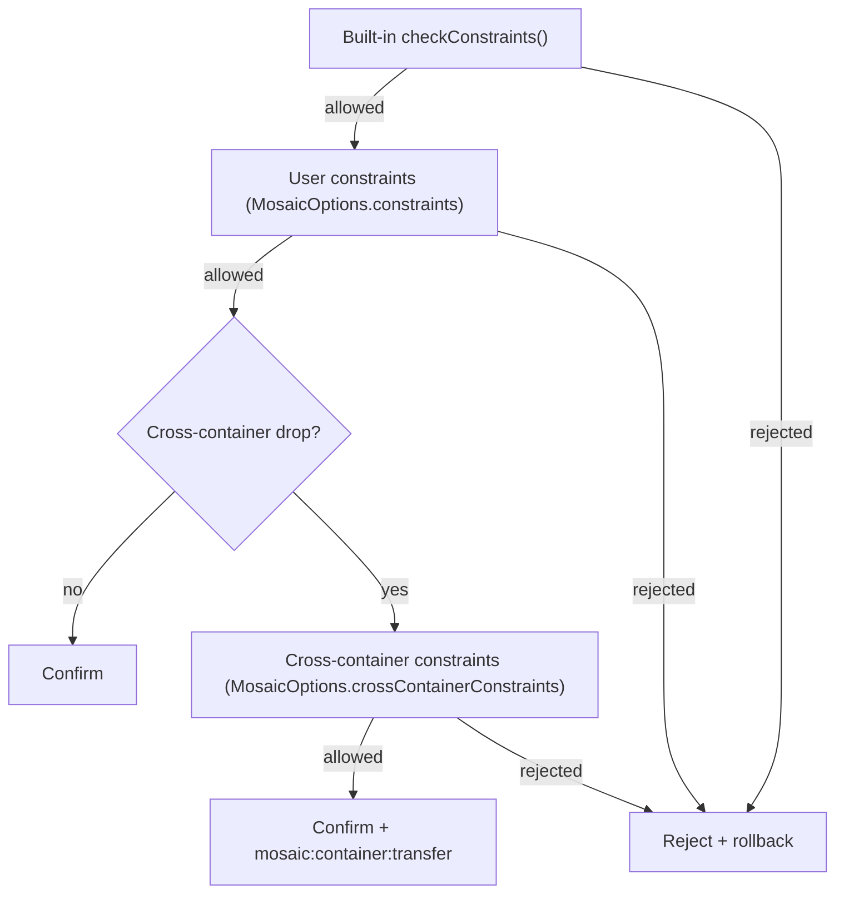

# Constraint Scoping Across Groups and Containers

MosaicJS evaluates a drop through up to three layers of constraints, in a
fixed order: **built-in constraints** (including group scoping) run first,
then any **user-registered group-level constraints**
(`MosaicOptions.constraints`), and — only for a drop resolved onto a linked
peer instance — **user-registered cross-container constraints**
(`MosaicOptions.crossContainerConstraints`). Each layer only runs once the
previous one has passed; a rejection at any layer short-circuits the rest.



All three layers share the exact same function signature —
`(input: ConstraintInput) => ConstraintResult` — so a constraint written for
one layer is trivially portable to another; the only difference is which
`MosaicOptions` array it's registered in (or, for built-ins, that it isn't
user-registered at all).

## Layer 1: Built-In Group Scoping (default behavior)

When `selectors.group` is configured, every drop is checked against the
dragged node's own origin group and the resolved target's group. A mismatch
is rejected with reason `"group-boundary"` — **the default is to reject
cross-group drops** — unless `MosaicOptions.crossGroupDrag` is explicitly
enabled.

```ts
const mosaic = new Mosaic({
  root,
  selectors: { node: ".card", group: ".lane" }
  // crossGroupDrag omitted — cross-group drops rejected by default
});
```

This is real, already-shipped behavior with no registration involved — see
[Group Containers](./group-containers) for the full picture, including the
`crossGroupDrag` option and the `mosaic:group:enter`/`leave` events fired
during a cross-group hover.

## Layer 2: User-Registered Group-Level Constraints

`MosaicOptions.constraints` lets you register additional business rules,
evaluated after the built-in checks above have passed. A common use is
allowing specific cross-group transfers under conditions the built-in
`crossGroupDrag` boolean can't express on its own (e.g. "urgent" cards may
move into any lane, but other cards may only move within their own lane).

```ts
const mosaic = new Mosaic({
  root,
  selectors: { node: ".card", group: ".lane" },
  crossGroupDrag: true, // let the built-in check pass through to this layer
  constraints: [
    (input) => {
      const isUrgent = input.dragged.classList.contains("urgent");
      const sameLane = input.sourceGroup === input.targetGroup;

      if (isUrgent || sameLane) return { allowed: true };

      return {
        allowed: false,
        reason: "lane-transfer-restricted",
        metadata: { sourceGroupId: input.sourceGroup?.id ?? null }
      };
    }
  ]
});
```

`input.sourceGroup`/`input.targetGroup` are the same real `HTMLElement | null`
group-container references `checkConstraints()`'s own built-in
`"group-boundary"` check uses internally — a user constraint sees exactly
what the built-in layer saw, not a re-derived approximation.

## Layer 3: Cross-Container Constraints

Cross-container constraints are a distinct concept from group-level ones:
they govern a drop moving between two entirely separate, **linked** `Mosaic`
**instances** — each with its own root, its own selectors, and potentially
its own group configuration — not two groups within a single instance.

Two instances must first be linked via `Mosaic.link(a, b)` before either can
ever receive a drop from the other — **the default is to reject a drop onto
an unlinked instance outright**, before any constraint (built-in or
user-registered) ever runs.

```ts
const board = new Mosaic({ root: boardRoot, selectors: { node: ".card" } });
const archive = new Mosaic({
  root: archiveRoot,
  selectors: { node: ".card" },
  crossContainerConstraints: [
    (input) => {
      // input.sourceInstanceId / input.targetInstanceId identify the two
      // instances involved — only populated for a cross-container drop.
      if (input.dragged.dataset.archivable !== "true") {
        return { allowed: false, reason: "not-archivable" };
      }
      return { allowed: true };
    }
  ]
});

board.initialize();
archive.initialize();
Mosaic.link(board, archive);
```

Cross-container constraints are evaluated against the **receiving**
(target) instance's own configuration — `archive`'s `crossContainerConstraints`
above, not `board`'s — mirroring how the target instance's own built-in and
user constraints (layers 1 and 2) are also evaluated using its own
`selectors`/`maxNestingDepth`/etc. rather than the dragging instance's. The
instance whose DOM is receiving the drop is the one whose rules govern
whether it accepts the incoming node.

A confirmed cross-container drop fires `mosaic:container:transfer` with
`{ sourceInstanceId, targetInstanceId, nodeId }`, in addition to the usual
`mosaic:mutation:confirmed`.

```ts
window.addEventListener("mosaic:container:transfer", (e) => {
  const { sourceInstanceId, targetInstanceId, nodeId } = e.detail;
});
```

## Full Evaluation Order

For a drop resolved onto a **linked peer** instance, the complete order is:

1. Built-in constraints (`checkConstraints()`) — evaluated against the
   target instance's own configuration, including its own group-boundary
   check if it configures `selectors.group`
2. The target instance's own `MosaicOptions.constraints` (user
   group-level constraints)
3. The target instance's own `MosaicOptions.crossContainerConstraints`

For a same-instance drop, step 3 never runs at all — `ConstraintInput`'s
`sourceInstanceId`/`targetInstanceId` fields are `undefined`, and evaluation
stops after step 2, exactly as it did before cross-container support
existed.

Every layer stops at its first rejection — a later layer never runs once an
earlier one (built-in or user, group-level or cross-container) has already
rejected the drop.

## Related

- [Group Containers](./group-containers) — the built-in group-scoping
  mechanism (layer 1) in full, including `crossGroupDrag` and the
  group-hover event pair
- [Constraints Design](./constraints-design) — the broader constraint
  evaluation model this page's three layers build on top of
- [Mosaic API Reference](/api/classes/Mosaic) — `Mosaic.link()`/`unlink()`/
  `arePeers()`/`getLinkedPeers()` and `mosaicInstanceId`, the multi-instance
  peer-linking primitives cross-container constraints (layer 3) depend on
