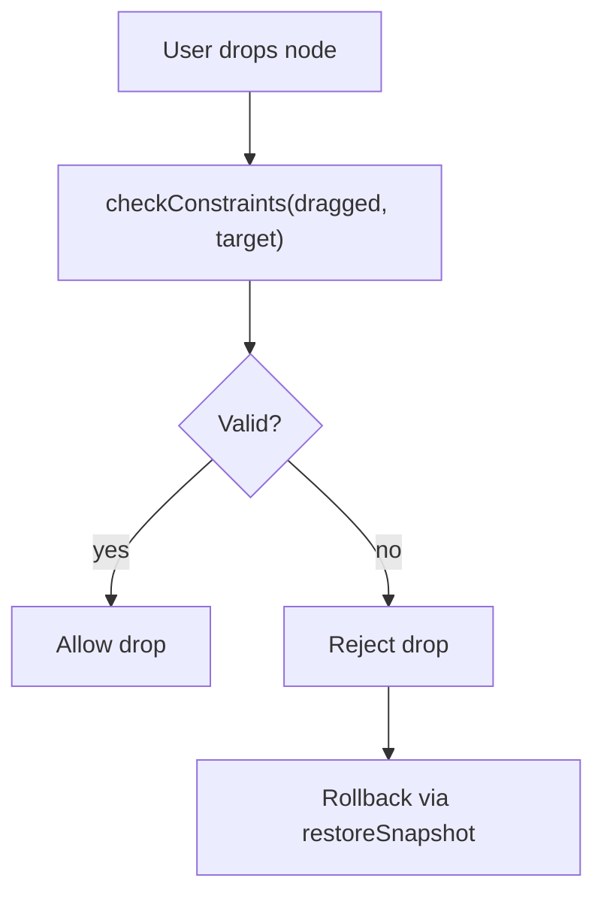

# Constraints Design

Constraints determine whether a drag operation may complete.  
They enforce structural rules and prevent invalid mutations.

## Mermaid Diagram: Constraint Evaluation



## Built-in Constraints (since v0.1)

### Self-Drop Handling
```typescript
if (dragged === target) {
  return { allowed: true }; // Self-drops are allowed as no-ops
}
```

### Selector Validation
```ts
if (!target.matches(options.selectors.node)) {
  return { allowed: false, reason: "invalid-target" };
}
```

## Extending Constraints (v0.2+)

You may chain constraints:

```ts
const result = allConstraints.map(fn => fn(...args))
  .find(r => r.allowed === false);
```

Future features will allow:

- hierarchical constraints
- group-based constraints
- restricted-parent rules
- custom constraint registration

## Guarantees

- Constraint evaluation is deterministic
- Rejecting a drop always invokes rollback

## See Also

- [Constraint Scoping Across Groups and Containers](./constraint-scoping) —
  how the group-boundary built-in check, user-registered group-level
  constraints, and cross-container constraints layer on top of each other,
  with the full evaluation order and real registration examples  