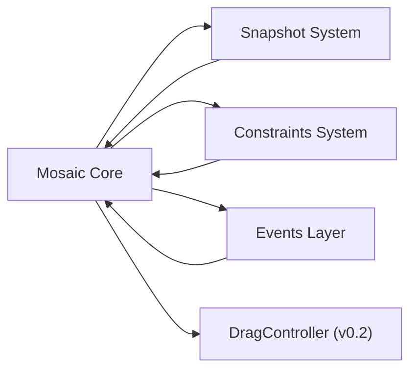
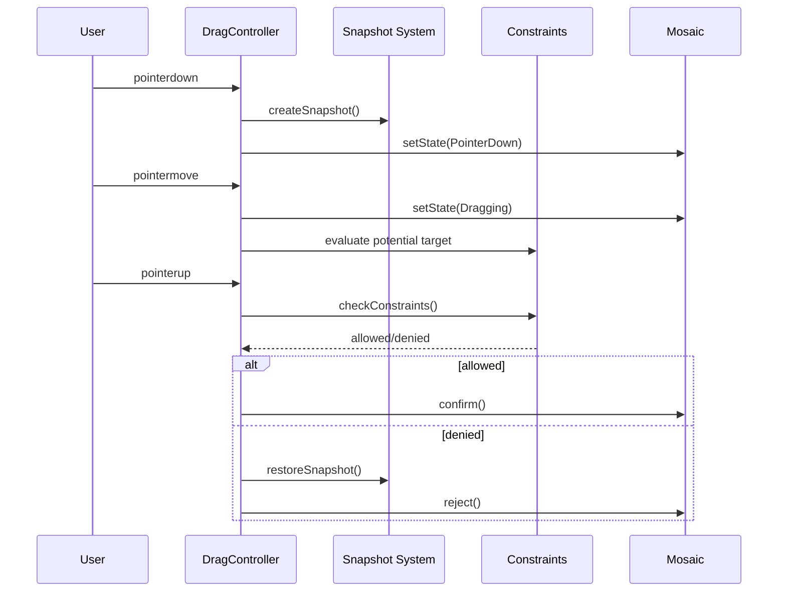

# Mosaic Architecture

Mosaic is a small, event-driven drag-and-drop engine.  
Its design emphasizes clarity, reversibility, and testability.

The system is organized into four cooperating subsystems:

1. **Mosaic Core** — orchestrates drag lifecycle, state transitions, and snapshot ownership
2. **Snapshot System** — captures and restores DOM structure for safe rollback
3. **Constraints System** — validates whether a potential drop is allowed
4. **Events Layer** — unified, typed event dispatch for all public signals

Drag behavior (pointerdown → pointermove → pointerup) is implemented in
*DragController*, connecting all subsystems.
---

## High-Level Mermaid Diagram



Mosaic Core is the conductor; all other modules are instruments.

---

## Mosaic Core

Responsibilities:

- initialize/destroy instance
- manage internal state machine
- hold the active snapshot
- commit or reject mutations
- emit lifecycle events (`mosaic:init`, `mosaic:destroy`)
- delegate drag logic to DragController

It never mutates the DOM directly except through snapshots.

---

## Snapshot System

The snapshot module provides:

- `createSnapshot(root)`
- `restoreSnapshot(snapshot)`

Snapshots store:

- parent element
- child index
- stable `data-mosaic-id`

This forms Mosaic’s guarantee: **invalid drags will always safely roll back**.

---

## Constraints System

Constraints are pure functions:

```ts
(dragged, target, options) => {
  allowed: boolean;
  reason?: string;
}
```

They decide:

- whether the drop is valid
- if not, why
- when rollback is required

The core constraints validate:

- self-drop
- selector mismatch

Future: hierarchical rules, custom constraint pipelines.

---

## Events Layer

All internal events flow through:

```ts
emit(name, detail?)
```

This standardizes Mosaic’s public surface:

- `mosaic:init`
- `mosaic:state`
- `mosaic:mutation:confirmed`
- `mosaic:mutation:rejected`
- `mosaic:rollback`

It ensures consistency across all UIs and frameworks.

---

## DragController

DragController will implement the pointer lifecycle:



This module completes Mosaic’s ergonomic drag story.

---

## Architectural Principles

- **Reversible:** every operation can be undone
- **Deterministic:** constraints and state transitions yield predictable results
- **Observable:** state and mutations broadcast through events
- **Isolated:** each subsystem is independently testable
- **Framework-agnostic:** Mosaic works with plain DOM, React, Vue, or Web Components

---

## Summary

Mosaic provides a robust foundation for drag-and-drop interfaces, focusing on:

- correctness over cleverness
- transparency over magic
- simplicity over implicitness

It is intentionally small, but the architecture scales toward complex, nested, constraint-driven drag UIs.