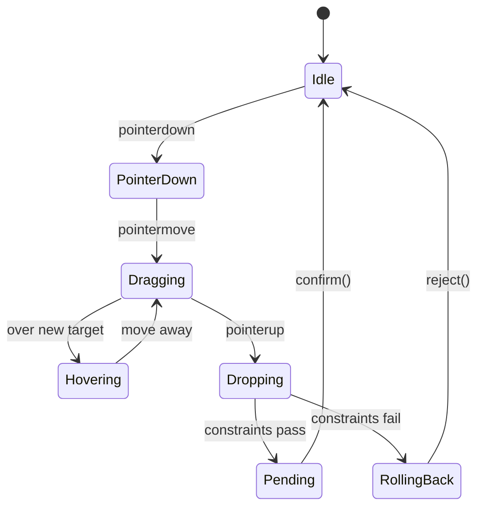

# Drag Lifecycle (v0.2 Preview)

Drag behavior in Mosaic follows a predictable progression:

1. **pointerdown** → capture active node + create snapshot
2. **pointermove** → update hover target + set state
3. **pointerup** → evaluate constraints & commit or rollback

---

## Mermaid Diagram: Drag State Machine



---

## PointerDown Phase

```ts
pointerDown(e) {
  this.activeNode = node;
  this.mosaic.snapshot = createSnapshot(root);
  this.mosaic.setState(MosaicState.PointerDown);
}
```

---

## Dragging Phase

- Node moves under pointer
- Hover target is computed (v0.2)
- State transitions to `Dragging`

---

## Dropping Phase

```ts
const result = checkConstraints(dragged, target, options);
```

- If `allowed`, Mosaic commits mutation and clears snapshot
- If rejected, Mosaic rolls back via `restoreSnapshot()`

---

## Guarantees

- Every invalid drag leads to rollback
- State transitions are deterministic
- Drag logic remains fully testable  