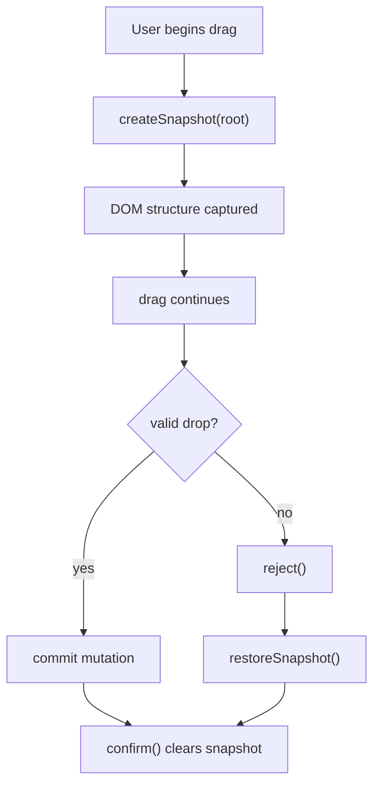

# Snapshot Flow

Mosaic uses snapshots to guarantee safe, reversible DOM mutations.  
A snapshot records each node’s:

- parent element
- index within its parent
- unique `data-mosaic-id`

Snapshots enable **rollback**, allowing Mosaic to undo invalid drag operations.

---

## Mermaid Diagram: Snapshot Lifecycle



---

## Snapshot Creation

```ts
const snap = createSnapshot(root);
```

This stores ordering information for all nodes under the given root.

## Snapshot Restoration

```ts
restoreSnapshot(snapshot);
```

This returns the DOM to its original recorded state.

---

## Guarantees

- Always safe to call
- Resistant to missing nodes
- Works with rollback flow  